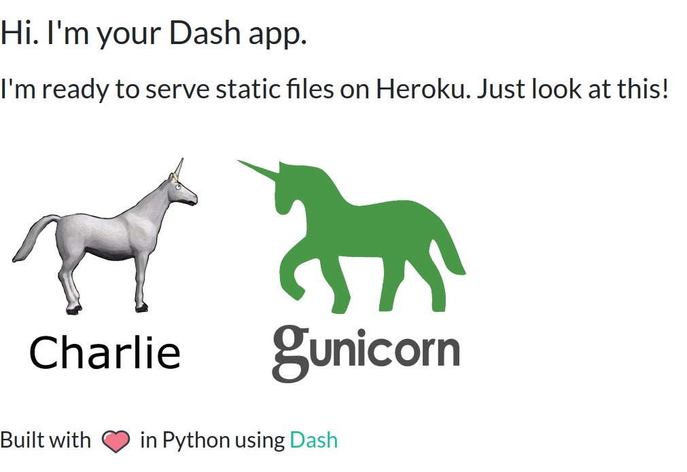

# dash-heroku
A running starter pack for deploying a Plotly Dash app on Heroku with support for hosting static files, such as images (a common pain point). For a comprehensive explanatory guide with jokes, see my [article](https://medium.com/p/39bd6a0c586c) on Towards Data Science :)
  

This app can be viewed live on Heroku infrastructure at [https://serene-dusk-42485.herokuapp.com/](https://serene-dusk-42485.herokuapp.com/)

## Overview of what each file does

For Heroku newbies, if this is your first attempt to get your Dash app on Heroku and you are pretending you're not scared, here is a quick fly over of all the files required. Some you will be familiar with, others look scary but they are not that bad once you know what they do.

`app.py` where the dash app lives  
`requirements.txt` python modules that will be installed onto the Heroku Dyno process (your linux webserver) at build  
`runtime.txt` simply tells Heroku (the Gunicorn HTTP server) which Python version to use  
`Procfile` tells Heroku what type of process is going to run (Gunicorn web process) and the Python app entrypoint (app.py)  
`/assets` this directory is ONLY to serve the favicon icon. It cannot be used to serve any other static files  
`/static` this is the directory from which you can serve all your static files (note this is seen as the root folder from your Dash app)  
`.gitignore` file telling git which files and directories to ignore when pushing to the remote repositories  

## Instructions

A full step-by-step guide is provided below to help you get your first Heroku app live. 
If you are a first-timer on Heroku, I suggest you get this starter app running on Heroku first, then you can adapt it to suit your needs by copy-pasting your locally running Dash app code across etc. 
Heroku also has a concise guide for [getting started on Python](https://devcenter.heroku.com/articles/getting-started-with-python) which is a useful reference.
  

## 1. Clone this repo to your local machine and install modules

It's a good idea to check you can get this app running on your local webserver before attempting to deploy on Heroku. So let's do that.
Setup your virtualenv (or don't) and ensure you have all the modules installed before running the app. 

**Getting the repo to your local machine**  
If you are  new to Github and not familiar with cloning, SSH and all that jazz, you can just download a zip file of this entire repo like a normal internet download. Basically get a copy of this repo to your local machine as step 1. (Hit the green 'code' button in the top right on Github to see the options for cloning or downloading this repo). Later on when you want to make changes to your repo, you will need to use Git commands and have ssh setup, or you can use the [Github desktop](https://desktop.github.com/) application, which is really nice on Windows and Mac.

**Install modules from the requirements.txt**  
You should be able to do this with pip3 or conda from a terminal in the project root folder

`pip3 install -r requirements.txt`  
`conda install --file requirements.txt` (if you are using Anaconda)
  

## 2. Test the app locally

Run the app from your IDE direct, or like a boss from the terminal: `python3 app.py`

If it runs, it should be visible on a browser via `http://0.0.0.0:8050`
  

## 3. Setup Heroku command-line-interface (CLI)

Depending on your OS, you may also need to install Git. Follow the general Heroku CLI [installation guide](https://devcenter.heroku.com/articles/heroku-cli). 
  

## 4. Create a Heroku account

You will also need a Heroku account (free tier is fine for a hobby app). Sign up [here](https://signup.heroku.com/login).
  

## 5. Login to Heroku via CLI

From your terminal window, login to Heroku CLI. This will open a browser window and you will need to login to your new Heroku account. 
Once done, return to your terminal and it should say 'Logged in as .... blah' (GOOD)

`heroku login`
  

## 6. Create a Heroku app linked to the Dash app

Now we must create a Heroku app that will magically link to your Dash app. ENSURE YOU ARE IN THE DASH PROJECT ROOT FOLDER IN A TERMINAL. Heroku docs on this step [here](https://devcenter.heroku.com/articles/getting-started-with-python#deploy-the-app).

`heroku create`

The above command will create your heroku app with a special unique name on the Heroku infrastructure. This name will be part of the public URL that gets created for your live app on the Heroku subdomain. So if you want a custom name that is a bit more intelligible, you can specify a name, but note Heroku will give an error if that name is already taken on their subdomain (by another Heroku user). So you may need to make it highly specific. 

`heroku create youruniqueappname`

You may need to try a few different options to find a unique name, but once done, your public URL will be prettier and easier to remember.
  

## 7. Deploy your app on Heroku

We are ready for the magic to begin. We will now do a Git push command to your remote Heroku app repository (which lives behind the scenes) and this will trigger a build of your Heroku app! 

`git push heroku main`

You should begin to see a bunch of console output in the terminal as Heroku deploys your app. Note it takes about 3 minutes. It should work fine on this repo, but as you add your own code in, be ready to watch for errors. Tip: as soon as the build finishes, bring up the live log tail with `heroku logs --tail`. This will show you the processes happening immediately after the build: Gunicorn web process trying to bring up your app.
   

## 8. View your running public app in a browser!

If the build succeeds, you will be given a URL at the end that might look something like [https://serene-dusk-42485.herokuapp.com/](https://serene-dusk-42485.herokuapp.com/) (this is live so you can see the app deployed). 
Copy paste the URL from your OWN console output into a browser, and with a few shakes of fairy dust, your app should be live :)
  

## 9. (OPTIONAL) Transfer your own Dash app code over to the app

Once you have the app running on Heroku, you can build on it as a base to get your own Dash app live. You could fork the repository, create your own stand alone repo and copy these project files over from the directory, download the repo as a zip, or simply just cut-and-paste the content from each file one at a time directly from this repo on Github without downloading anything. Just be wary that Heroku can be a bit temperamental with some Python packages. Be careful of your app's RAM requirements too, remembering that you only have 500MB of memory to play with (on the free Heroku tier), far less than you might be used to compared with your local machine.
  

# Troubleshooting

### Sometimes you may need to create a new Heroku app  
If you make major changes to file structure in your project, you may need to create a new Heroku app with `heroku create` and then `git push heroku main`. This can be annoying but it's only one extra step. I found that once my file structure was stable, if I was just changing code within an existing file, to deploy a new version just ensure you update your remote repo on github i.e. `git push origin main` FIRST. When your remote repo is fully up to date with the latest changes, then you can redeploy to Heroku really easily with a simple `git push heroku main`

### Heroku sometimes might not support the latest python modules  
Just be aware that you may not be able to use the very latest packages. I think Heroku has to add special support for this so their packages can sometimes trail the latest ones you may be running on your local machine. You will see errors if this happens though so it will be obvious when you try to build and deploy. Just watch the console.

### If your build succeeds but you get 'APPLICATION ERROR' in the Browser  
This is highly annoying, but it means something went wrong after the build, when the Gunicorn webserver tried to bring up your app. The most common run-time errors I encountered were 'MODULE NOT FOUND' errors (because my `requirements.txt` was not up to date) or memory overrun errors (my app was using too much RAM). To view what is going on at a low level the most direct way is to view the live log tail from the terminal (console). This will show you the dyno web process (i.e. Gunicorn) trying to come up. And if there is a crash you can see what has gone wrong. Also note, this log tail will view console output from your app itself (print statements and logger statements etc) so it's a great way to get a low level view of your app, similar to when you are running it from your local machine; it just has extra stuff in it such as Heroku errors and Dyno errors mixed in aswell. Just type this command into your terminal window after the build has finished.

`heroku logs --tail`

### Memory overrun issues are common with Dash apps. Lower your web concurrency explicitly.
One of the most common problems I had was my Dyno (Linux server) running out of memory as it tried to bring the app up. This is because Gunicorn is a production webserver, and by default will often spawn 6 concurrent web processes (6 instances of your app) for your Dyno to run, each requiring the full amount of RAM your app uses. When you are running your Dash app on your local machine (local webserver) only 1 web process is used. So what this means is your Dyno needs 6 x the RAM as you might think it does to run your app, and you've only got 500MB to work with. The reason this happens is so Gunicorn can manage many incoming connections (users) in parallel. It's not always obvious that the memory has run out, as the Gunicorn web process just keeps crashing before it finishes and then restarts in an infinite loop. Because Python apps are usually playing with dataframes and lots of data, I think Heroku underestimates by default how much memory they need, and the default setting of 6 instances is just too high.

If you run into this problem, just manually set web concurrency in Heroku to a low number like 1, 2 or 3. Type this command into the terminal to permanently set it for your app.

`heroku config:set WEB_CONCURRENCY=1`  
or
`heroku config:set WEB_CONCURRENCY=1 -a <herokuappname>`  

You can also monitor your Dyno memory level by another command that permanently adds system metrics to the Heroku log and console output. This prints out the disk and memory level of your Dyno process to the Heroku log tail every 5 seconds.

`heroku labs:enable log-runtime-metrics`

If you have a high horsepower app and a single instance requires more than 500MB RAM (e.g. you are reading more than 500MB of data into memory or doing large data operations) then you simply must scale your Dyno to a more powerful one. You will need to update your Heroku account to a paid plan, then you can scale your Dyno up. Heroku Dyno specs can be viewed [here](https://devcenter.heroku.com/articles/dyno-types). Type the command below to scale to a standard-2x Dyno with 1024MB of RAM running on a single web process.

`heroku ps:scale web=1:standard-2x`

### Heroku has an immutable 30 second timeout for serving HTTP requests

It’s important to be aware that Heroku has an immutable 30 second timeout for serving HTTP requests. This is a common problem especially encountered by Dash users because many of the data science applications have long load times as they build big complex charts. These might work fine running on your local host, but be aware that your Heroku deployed app MUST be able to serve within 30 seconds or it will time out. Heroku docs state a few work arounds but take special note of this problem.

### Bring up a bash terminal to your Heroku app

If you are really struggling and confused with what is going on, note you can bring up a Bash terminal direct to your app, and see what Heroku sees. This might give you an insight for why data isn't loading or show you missing files that you can then troubleshoot for why they are not there. An example of where I needed to do this is my `.gitignore` was incorrectly ignoring a directory containing data I needed. The data existed on my local machine so the app worked fine locally, but I could not work out why it wasn't working on Heroku (which only has what is in your remote repo on Github). By bringing up a terminal, I could see that the files were missing in the Heroku deployment, and was able to trace it back to my `.gitignore` file :) 

`heroku run bash -a <yourherokuappname>`

### Heroku isnt building the right app when you do a `git push heroku main` or you get a fatal error

If you start playing around with successive Heroku apps, sometimes the Heroku remote repository (the one that actually builds to your running app) gets decoupled from the local repository (or heroku app) you are working on, or it stays linked to a previous heroku app you no longer want to use. This can be frustrating, but you can easily fix it to a specific heroku app you want.

After you have built a heroku app linked to you local repo with `heroku create`, list your available apps with `heroku apps`. Ensure you know the heroku app name you want actually deployed.

Check your git remote repos with `git remote -v` 

If the heroku remote has a different app name to the one you want, simply replace it with:

`heroku git:remote -a <herokuappname>`

This binds the heroku remote to the heroku app you actually want to deploy. Then you can just type `git push heroku main` and you know exactly which app is being deployed. Note this hopefully won't happen to you, but invariably you can run into these kind of glitchy things when playing around with lots of different heroku apps as you try to get your Dash app deployed.
